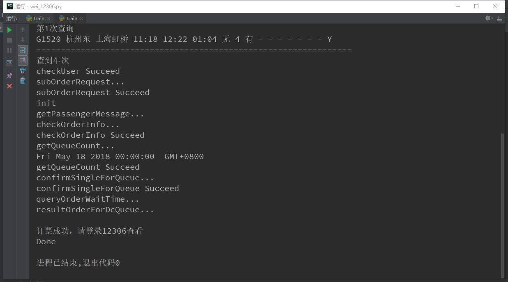
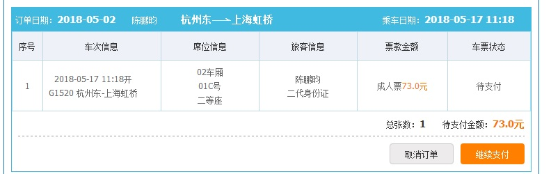

# 12306  
***貌似已失效***  
- python 实现12306自动抢票
- 使用前需登录[12306](https://kyfw.12306.cn/otn/leftTicket/init)查看车次信息并填入User_Info
# 文件
- train --- 主程序
- Config --- 配置信息（主要是url信息）
- city_code --- 城市代码
- User_Info --- 个人账户及车票信息（需要修改的文件）
# 流程
- 验证码，需要手动输入，程序自动下载验证码，并打开，只需将目标位置填入程序中
- 

- 完成订票
- 

- 然后到12306官网完成付款
- 

